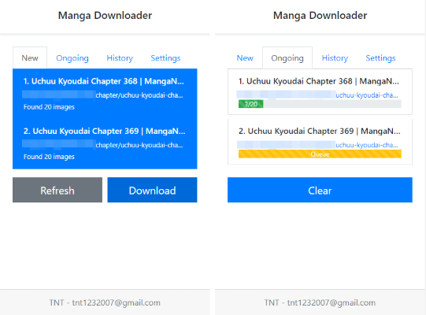
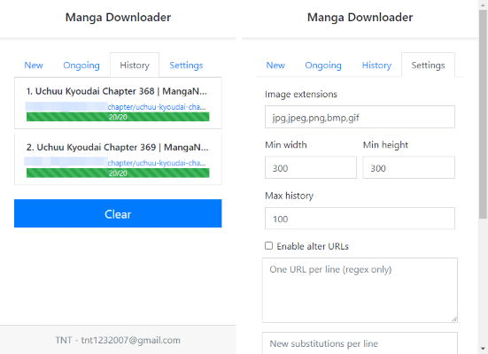

# </img> Manga Downloader

A powerful manga downloader as Chrome extensions. Specialized in downloading images naming in order, from multiple tabs into separate folders.

</img>
</img>

## Getting Started

- [Installation](https://chrome.google.com/webstore/detail/manga-downloader/dcaaabmopjlkogkeahlbehpnppgleahf)
- [Donate](https://www.buymeacoffee.com/tnt1232007)

## Support
- [Email](mailto:tnt1232007@gmail.com)
- [Issues](https://github.com/tnt1232007/mangadownloader/issues)

## Features

- Support for major Chromium-based browsers: Google Chrome, Microsoft Edge, Opera, etc.
- Able to scan all images in all tabs of current browser window, refresh on request
- Allow select which tabs to initiate download
- Able to download and rename sequentially in order of appearance
- Download in background, auto retry download via respected tab if failed
- Able to track ongoing downloads, abort on request
- Able to track download history, clear on request
- Fully configurable on filtering images by extensions, size, url
- Fully configurable on altering part of urls
- Options to limit history records
- Options to close tab after download
- And a beautiful UI
